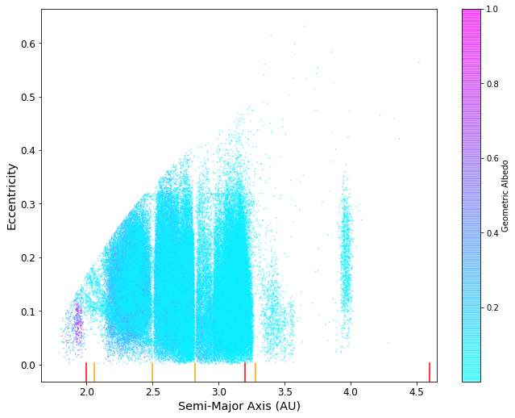

There's no plot title, which is a bit glaring to me. The plot has a lot of information density though which is really interesting. The points in the upper-right of the plot are very hard to see, maybe it's a bit too light/bright in color. Also, between 2.0-2.5 AU, it appears that there's some extra features that are very hard to see, some high-albedo points hidden behind the low-albedo points. A key would also be good to mark maybe "asteroids, inner-main-outer points, and Kirkwood Gaps".

# FBB 
the assignment requested to specifically comment on 3 points: aesthetic, clarity, and honesty.  I see suggestions but they are largely at the level of opinions. If you had linked them to one of the three topics they might have been valid arguments. 

95%
